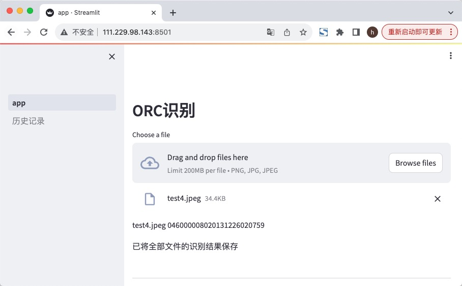
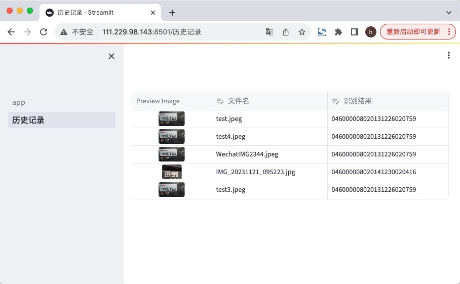

# baidu_ocr
用百度ocr来识别数字

## 笔记

[管理secrets](https://docs.streamlit.io/library/advanced-features/secrets-management)

[管理静态文件](https://docs.streamlit.io/library/advanced-features/static-file-serving)

测试起来环境变量好像没用，还是在.streamlit里的toml设置文件有效果
